<p align="center">
  
</p>

<h1 align="center">SmartPack</h1>

<p align="center">
  <strong>Pack more. Carry less. Play smarter.</strong>
  <br>
  A Paper plugin for fast, safe Minecraft inventory compression with <code>/condense</code>.
</p>

SmartPack condenses configured materials directly from a player's inventory, turning loose resources into compact storage blocks without risky manual crafting loops.

It is built for storage-style conversions such as nuggets to ingots, ingots to blocks, redstone to redstone blocks, and other server-configured recipes. SmartPack adds practical guardrails around those conversions: configurable crafting-table requirements, reversible-recipe validation, inventory safety checks, player exclusions, optional auto-packing, and reloadable config.

This project is a fork of the original MinecraftCondensePlugin by `rd156`.

<p align="center">
  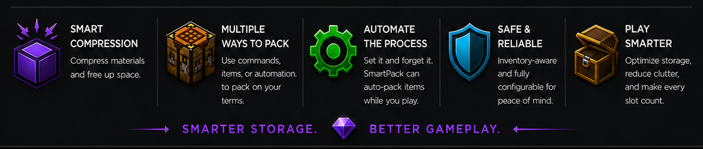
</p>

## Why SmartPack

- **Smart compression:** Compress materials and free up inventory space.
- **Multiple ways to pack:** Use commands, a crafted item, or automation depending on server preference.
- **Automate the process:** Let permitted players auto-pack items while they play.
- **Safe and reliable:** Simulates inventory changes before applying them to prevent item loss.
- **Play smarter:** Reduce clutter and make every slot count.

## What It Does

- Packs items using recipes defined in `config.yml`
- Works directly from the player's inventory
- Supports both command activation and Condenser item activation
- Supports optional trigger-based auto-packing with actionbar feedback
- Supports optional crafting-table requirements
- Can allow small recipes to bypass the crafting-table requirement
- Lets each player exclude configured materials through `/condense exclude`
- Simulates inventory changes before applying them to prevent item loss
- Can include nearby pickup items in inventory-full slot estimates
- Automatically removes leftover Condenser items while running in `COMMAND` mode
- Warns about non-reversible recipes and can disable them automatically
- Reloads configuration in game with `/condense reload`

## Requirements

- Java 21
- Paper 1.21.11
- Maven 3.x to build from source

The plugin is built against `io.papermc.paper:paper-api:1.21.11-R0.1-SNAPSHOT`.

## Build

```bash
mvn clean package
```

The built jar will be created in `target/` as `condense-reforged-<version>.jar`.

## Install

1. Build the jar with Maven or use a packaged release.
2. Place the jar in your server's `plugins/` directory.
3. Start the server once to generate `plugins/CondenseReforged/config.yml`.
4. Adjust the config if needed.
5. Run `/condense reload` or restart the server after changes.

## Commands

| Command | Description | Permission |
| --- | --- | --- |
| `/condense` | Pack any configured materials the player is carrying | `condense.use` |
| `/condense exclude` | Open a GUI to toggle which configured inputs should be skipped for that player | `condense.use` |
| `/condense auto` | Toggle automatic packing for the player | `condense.use` + `condense.auto` |
| `/condense reload` | Reload the plugin configuration | `condense.reload` |

`/condense` is player-only. `/condense reload` can be run by any sender with permission.

If `activation.mode` is set to `CONDENSER_ITEM`, regular packing is triggered by right-clicking the special Condenser item in the player's own inventory.

In item mode, shift-right-clicking the Condenser item in the player's inventory enables that player's saved auto-pack preference when auto-pack is available for the server and mode.

Admins can also enable `/condense` in item mode with `activation.condenser_item.allow_command_with_item: true`. When that toggle is on, the command only works if the player is carrying a Condenser.

## Permissions

| Permission | Description | Default |
| --- | --- | --- |
| `condense.use` | Allows players to use `/condense` | `true` |
| `condense.auto` | Allows automatic packing when `auto_condense.enabled` is true | `false` |
| `condense.reload` | Allows reloading the plugin config | `op` |

## How Packing Works

When a player runs `/condense`, SmartPack:

1. Loads the configured recipe list from `config.yml`.
2. Checks whether the player's crafting-table requirement is satisfied for each recipe.
3. Counts matching materials in the player's inventory.
4. Simulates removing the inputs and adding the outputs before changing the real inventory.
5. Applies successful conversions and repeats until no more configured conversions can run.

<table>
  <tr>
    <td width="50%">
      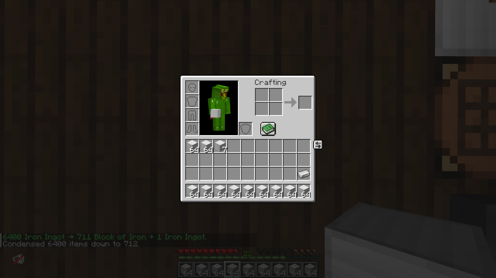
      <br><strong>Fast inventory packing</strong><br>
      Large stacks compress directly from the player inventory, with chat summarizing the final result.
    </td>
    <td width="50%">
      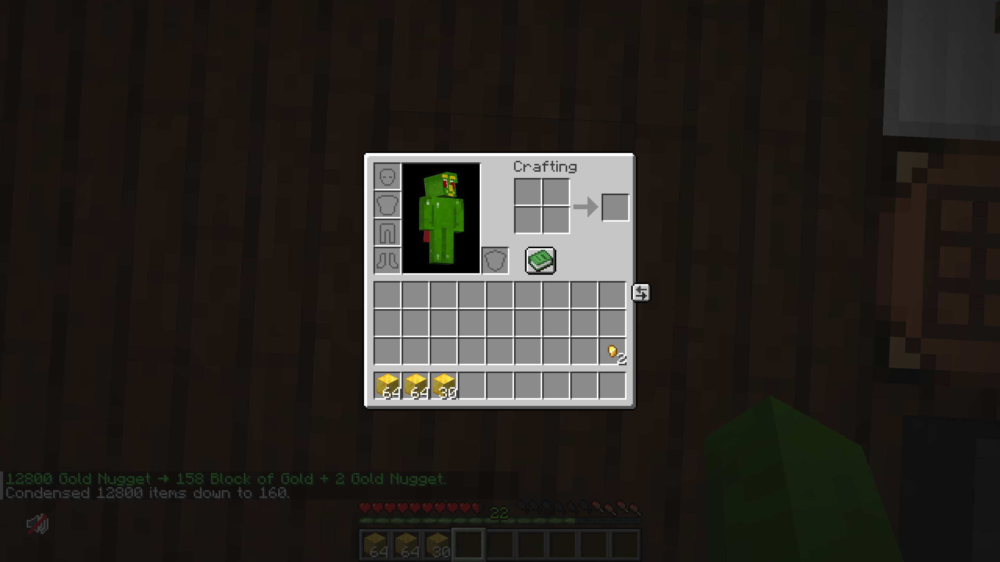
      <br><strong>Multi-tier compression</strong><br>
      Tiered recipes can continue in one run, such as nuggets turning into blocks with leftovers preserved.
    </td>
  </tr>
</table>

If the output would not fit, the plugin leaves the inventory unchanged for that conversion and reports how many extra slots would have been needed.

<p align="center">
  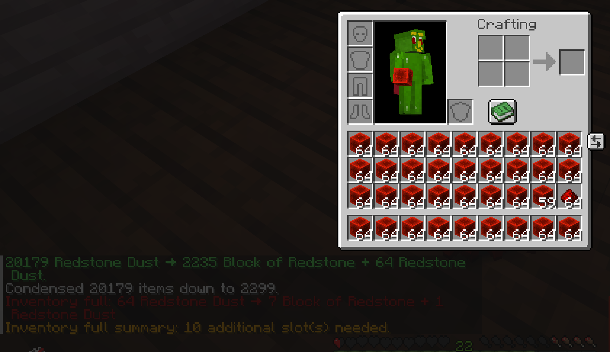
  <br><strong>Inventory-full safety</strong><br>
  The plugin reports the blocked conversion and estimates how many extra slots would be needed.
</p>

When `inventory_full.include_nearby_pickups` is enabled, that slot estimate also includes item entities already within the configured nearby pickup radius. The estimate condenses those nearby materials with the same configured recipes, exclusions, crafting-table rules, and multi-tier chaining used by the main condense flow before counting the final slots needed.

Players can also open `/condense exclude` to choose configured input materials that should be ignored:

<p align="center">
  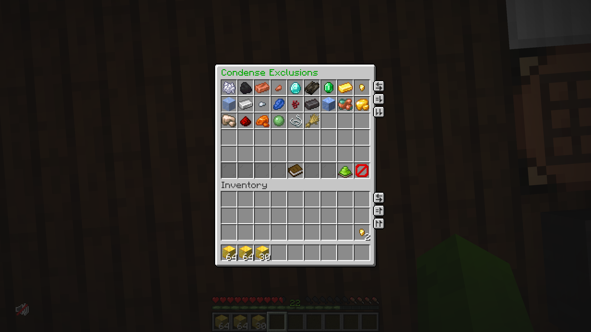
  <br><strong>SmartPack Exclusions menu</strong>
</p>

- Left-click marks a material to be skipped on the next condense run only.
- Right-click toggles a persistent per-player exclusion saved in `player-exclusions.db`.
- Glowing slots indicate that an exclusion is currently active for that material.
- Closing the menu normally, or using the green apply button, keeps the current changes and closes the menu.
- The red `X` button in the bottom-right corner cancels all edits made during the current menu session.
- After each condense cycle, the plugin reports any excluded configured inputs that were left skipped in the player's current storage inventory.

<table>
  <tr>
    <td width="50%">
      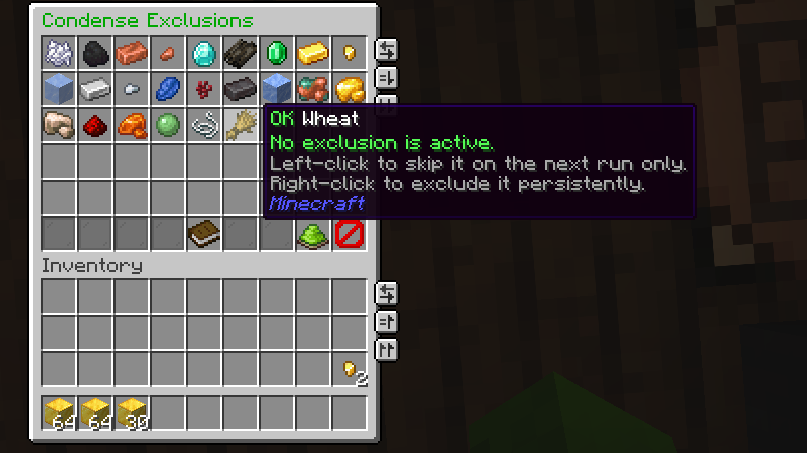
      <br><strong>Normal input state</strong><br>
      Regular entries show the available one-time and persistent exclusion actions.
    </td>
    <td width="50%">
      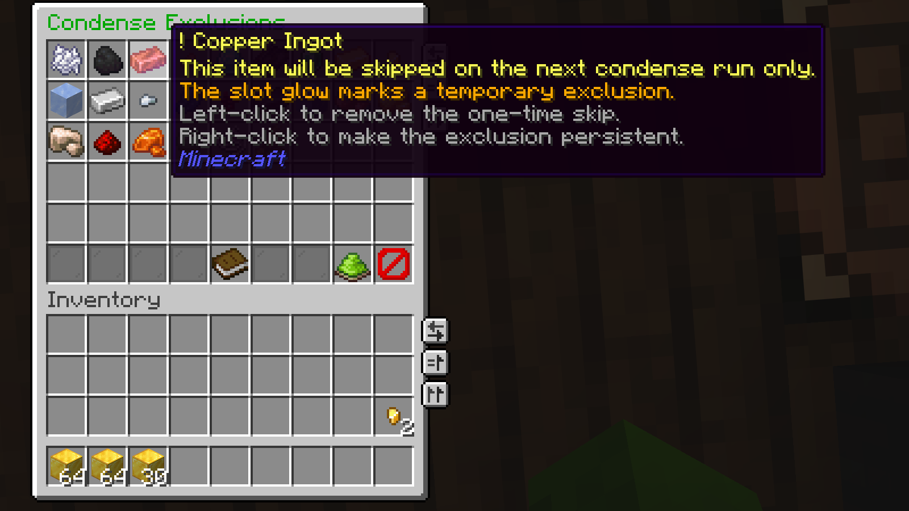
      <br><strong>Next-run skip</strong><br>
      Yellow marked entries are skipped once, then automatically return to normal.
    </td>
  </tr>
  <tr>
    <td width="50%">
      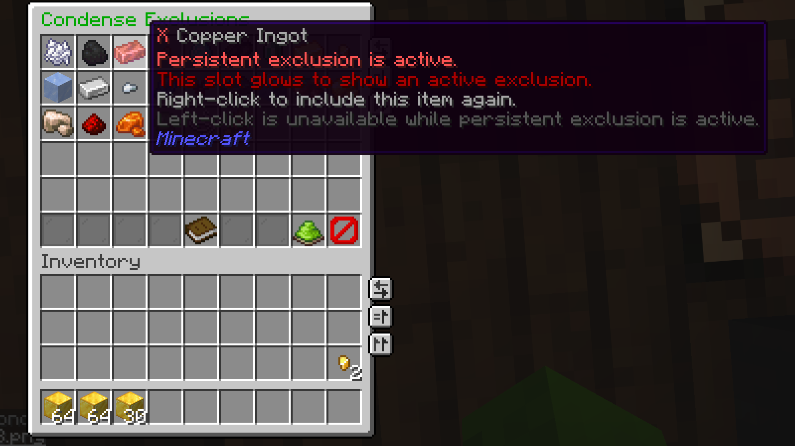
      <br><strong>Persistent exclusion</strong><br>
      Red marked entries remain excluded across future condense runs until toggled back on.
    </td>
    <td width="50%">
      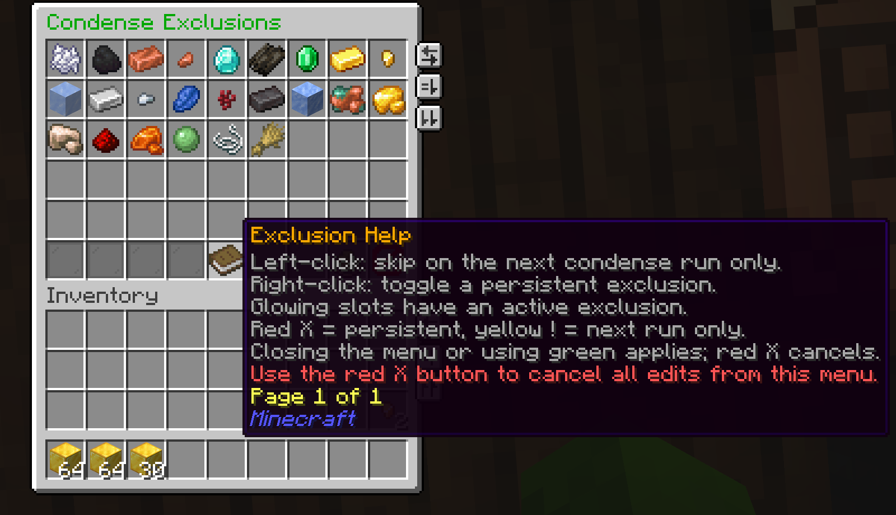
      <br><strong>Built-in menu help</strong><br>
      The help item explains left-click, right-click, glowing slots, apply, and cancel behavior.
    </td>
  </tr>
  <tr>
    <td width="50%">
      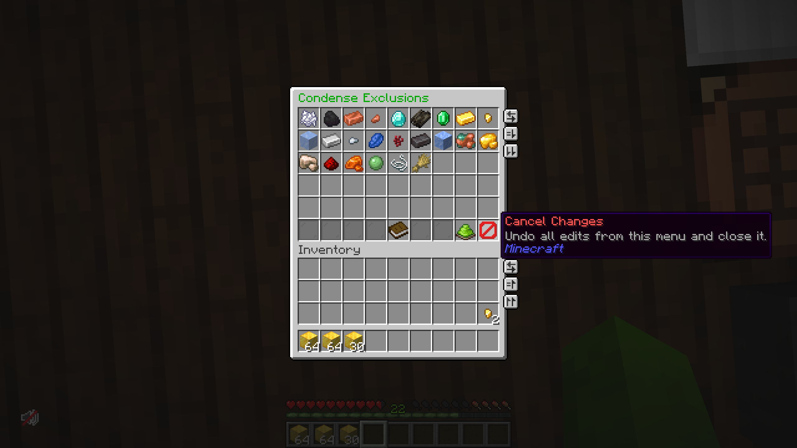
      <br><strong>Apply and cancel controls</strong><br>
      The bottom-row controls let players keep their current edits or cancel everything from the menu session.
    </td>
    <td width="50%">
      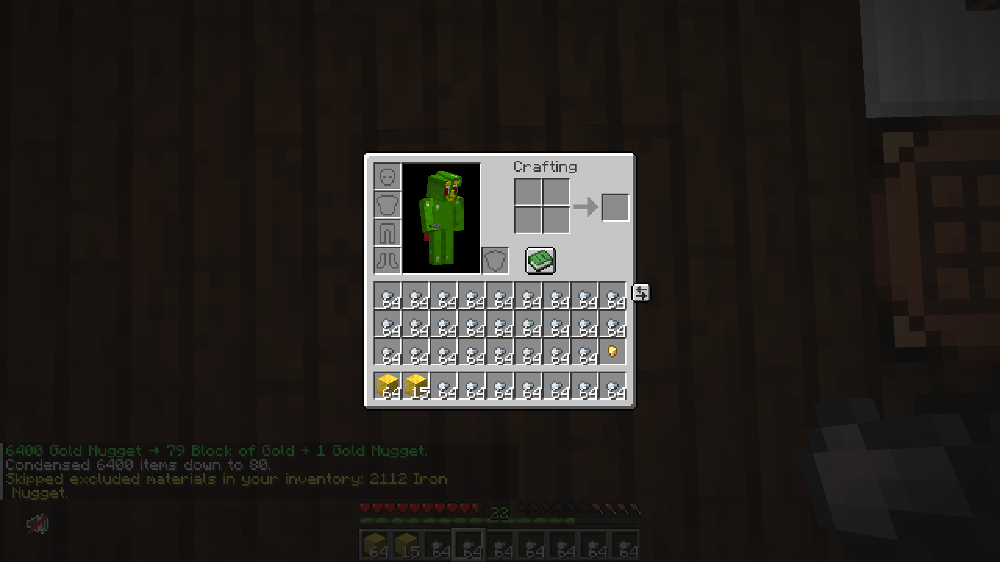
      <br><strong>Skipped excluded materials</strong><br>
      Excluded inputs stay in the inventory and the player gets a clear skipped-materials message.
    </td>
  </tr>
</table>

## Auto-Pack

When `auto_condense.enabled` is true, players with both `condense.use` and `condense.auto` can automatically pack configured materials shortly after supported triggers. By default, this includes picking up item entities and, when command-mode crafting-table requirements accept nearby tables, placing a crafting table or entering the configured crafting-table range.

Auto-pack uses the same conversion flow as manual activation, including configured recipes, reversible-recipe disabling, inventory simulation, multi-tier chaining, inventory-full checks, and player exclusions. Persistent exclusions are always respected. Next-run exclusions also apply to the next automatic run because they apply to the next pack cycle.

Players can use `/condense auto` to toggle automatic packing for themselves. In Condenser item mode, they can also shift-right-click the Condenser item in their inventory to enable auto-pack. The preference is saved in `player-exclusions.db`; before a player changes it, `auto_condense.default_enabled` controls their default state and defaults to `false`. The server-wide `auto_condense.enabled` setting, current-mode auto-pack setting, and `condense.auto` permission are still required.

Successful automatic runs send one final actionbar message using `message.auto_condense.actionbar`. If a conversion cannot safely fit output, the player receives an actionbar warning using `message.auto_condense.inventory_full_actionbar`, throttled by `auto_condense.feedback.inventory_full_cooldown_ticks`.

In `COMMAND` mode, auto-pack follows the normal `requirements.*` crafting-table rules. In `CONDENSER_ITEM` mode, auto-pack is disabled by default; if enabled, it follows item-mode behavior by ignoring `requirements.*` and can require the player to carry a Condenser item.

The nearby crafting-table triggers use `requirements.crafting_table_range` and only run when `requirements.crafting_table_mode` is `NEARBY_ONLY` or `INVENTORY_OR_NEARBY`. When `INVENTORY_OR_NEARBY` is already satisfied by a crafting table in the player's inventory, the nearby trigger checks are skipped.

When `activation.mode` is `CONDENSER_ITEM`, the same condense flow is triggered by right-clicking the Condenser item in the player's inventory. The Condenser is a custom crafting table item with a glint and a configurable recipe.

In Condenser item mode, the plugin ignores the `requirements.*` crafting-table checks entirely. The Condenser item itself is also not placeable as a block.

## Activation Modes

`activation.mode` supports two modes:

| Mode | Behavior |
| --- | --- |
| `COMMAND` | Players use `/condense` |
| `CONDENSER_ITEM` | Players use a crafted Condenser item in their inventory |

The Condenser recipe is only registered with the server when `activation.mode` is `CONDENSER_ITEM`.

When the plugin is running in `COMMAND` mode, it automatically removes leftover Condenser items from player inventories on startup, on `/condense reload`, and when players join.

`activation.condenser_item.allow_command_with_item` controls whether `/condense` is also available in item mode:

- `false`: players must right-click the Condenser in inventory
- `true`: players can either right-click the Condenser or use `/condense`, but only while carrying a Condenser

The Condenser item tooltip lists both item interactions:

- Instant mode: right-click to condense carried materials now
- Auto mode: shift-right-click to enable pickup packing

<table>
  <tr>
    <td width="50%">
      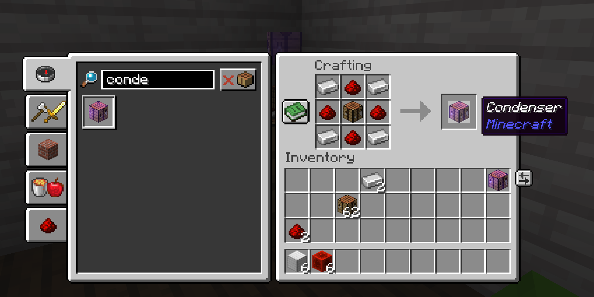
      <br><strong>Crafted Condenser item</strong><br>
      In item mode, the configured recipe creates a named Condenser item with a glint.
    </td>
    <td width="50%">
      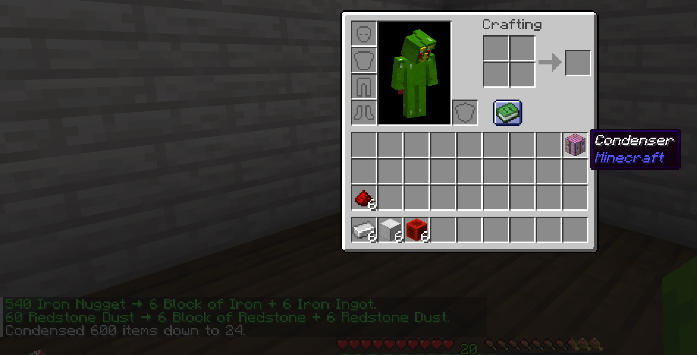
      <br><strong>Condenser activation</strong><br>
      Right-clicking the Condenser from the player inventory runs the same condense flow.
    </td>
  </tr>
</table>

## Crafting Table Requirement Modes

`requirements.crafting_table_mode` supports four modes:

| Mode | Behavior |
| --- | --- |
| `DISABLED` | No crafting table is required |
| `INVENTORY_ONLY` | The player must carry a crafting table |
| `NEARBY_ONLY` | The player must be within range of a placed crafting table |
| `INVENTORY_OR_NEARBY` | Either condition is accepted |

These settings only apply when `activation.mode` is `COMMAND`.

<table>
  <tr>
    <td width="50%">
      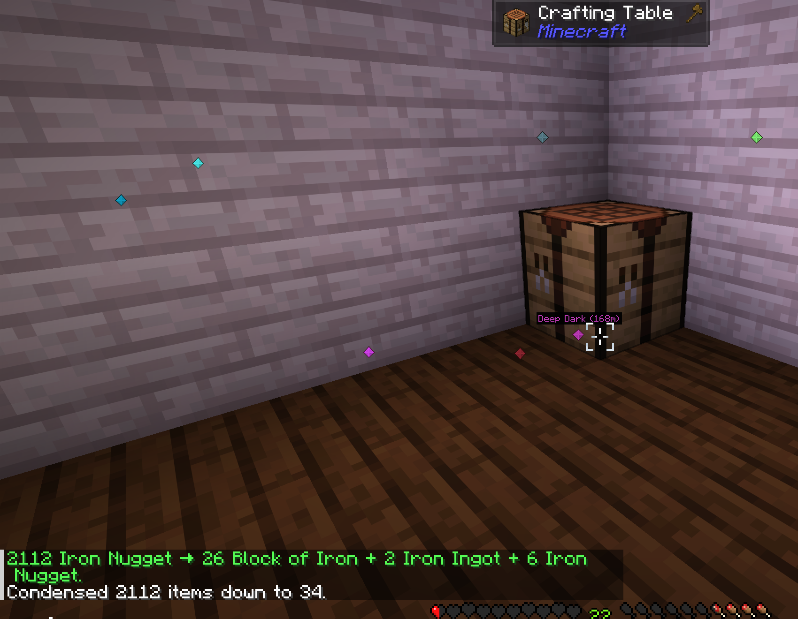
      <br><strong>Nearby crafting table accepted</strong><br>
      When nearby-table mode is enabled, standing within range lets larger recipes run.
    </td>
    <td width="50%">
      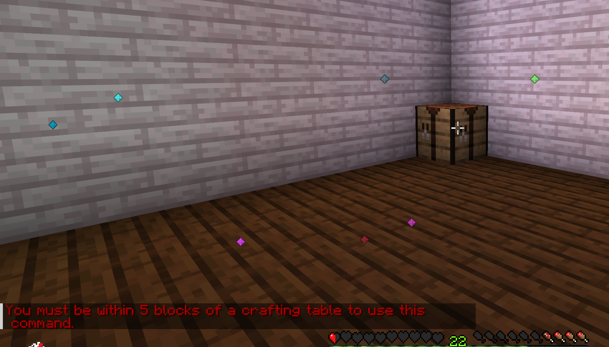
      <br><strong>Out-of-range protection</strong><br>
      Players get a clear message when a recipe requires a crafting table and none is close enough.
    </td>
  </tr>
</table>

Related settings:

- `requirements.crafting_table_range`: search radius for nearby crafting tables
- `requirements.bypass_crafting_table_for_small_recipes`: lets small recipes ignore the requirement
- `requirements.small_recipe_bypass_max_ratio_in`: maximum `ratio_in` that qualifies as a small recipe

## Reversible Recipe Validation

The plugin validates configured recipes during startup and reload:

- `validation.warn_if_not_reversible`: logs a warning when a configured recipe does not appear reversible based on the server's loaded crafting recipes
- `validation.disable_non_reversible_recipes`: prevents those recipes from running at all

This is useful if your server has datapacks or custom recipes and you only want storage-style conversions that can be crafted back cleanly.

## Default Recipe Set

The bundled `config.yml` includes reversible vanilla-style compression recipes ordered by input material family:

- `BONE_MEAL -> BONE_BLOCK`
- `COAL -> COAL_BLOCK`
- `COPPER_NUGGET -> COPPER_INGOT`
- `COPPER_INGOT -> COPPER_BLOCK`
- `DIAMOND -> DIAMOND_BLOCK`
- `DRIED_KELP -> DRIED_KELP_BLOCK`
- `EMERALD -> EMERALD_BLOCK`
- `GOLD_NUGGET -> GOLD_INGOT`
- `GOLD_INGOT -> GOLD_BLOCK`
- `IRON_NUGGET -> IRON_INGOT`
- `IRON_INGOT -> IRON_BLOCK`
- `LAPIS_LAZULI -> LAPIS_BLOCK`
- `NETHERITE_INGOT -> NETHERITE_BLOCK`
- `RAW_COPPER -> RAW_COPPER_BLOCK`
- `RAW_GOLD -> RAW_GOLD_BLOCK`
- `RAW_IRON -> RAW_IRON_BLOCK`
- `REDSTONE -> REDSTONE_BLOCK`
- `RESIN_CLUMP -> RESIN_BLOCK`
- `SLIME_BALL -> SLIME_BLOCK`
- `WHEAT -> HAY_BLOCK`

You can add or remove entries under the `condense:` section to customize the behavior.

## Configuration Overview

The main config sections are:

- `config-version`: internal migration/version marker
- `activation.*`: command vs Condenser-item activation, including whether `/condense` is allowed in item mode
- `auto_condense.*`: optional automatic packing triggers, cooldowns, mode policy, and actionbar feedback
- `display.list`: enables one final chat line per original condensed input after the condense cycle completes
- `inventory_full.*`: controls inventory-full slot estimation, including nearby pickup item scanning
- `requirements.*`: crafting-table requirement behavior
- `validation.*`: reversible recipe warnings and disabling
- `message.*`: all user-facing plugin messages
- `condense.*`: the actual conversion recipes

Recipe format:

```yml
condense:
  IRON_INGOT:
    output: IRON_BLOCK
    ratio_in: 9
    ratio_out: 1
```

## Message Placeholders

The configurable messages use these placeholders:

- `[item1]`: original input amount and material for a completed condense line
- `[item2]`: final condensed result for that original input, including leftovers
- `[input]`: total original input count condensed in the final summary
- `[output]`: total final item count after packing in the final summary
- `[items]`: combined final condensed materials if the summary template uses a material list
- `[slots]`: number of additional inventory slots needed
- `[range]`: configured crafting-table search range
- `[mode]`: invalid crafting-table mode from config

Inventory-full settings:

- `inventory_full.include_nearby_pickups`: includes already-nearby item entities in slot estimates when a condense result cannot fit, after simulating any configured condensation they can undergo
- `inventory_full.pickup_radius`: radius used for the nearby item scan

## Notes For Server Owners

- Invalid materials or invalid ratios are logged and skipped.
- Non-item materials are rejected during validation.
- Legacy crafting-table settings are migrated to `requirements.crafting_table_mode`.
- Persistent player exclusions are stored in `player-exclusions.db`.
- On first startup after upgrading, any existing `player-exclusions.yml` data is migrated into SQLite and the legacy file is backed up as `player-exclusions.yml.bak`.

## Project Layout

```text
src/main/java/crosis47/minecraft/condense/
  CondensePlugin.java
  commands/CondenseCommand.java
  storage/PlayerExclusionStore.java
  requirements/CraftingTableMode.java

src/main/resources/
  plugin.yml
  config.yml
```

## License

This project is licensed under the GNU General Public License v3.0. See [License.md](License.md).

## Credits

- Original project: [rd156/MinecraftCondensePlugin](https://github.com/rd156/MinecraftCondensePlugin)
- Fork and current maintenance: `crosis47`
